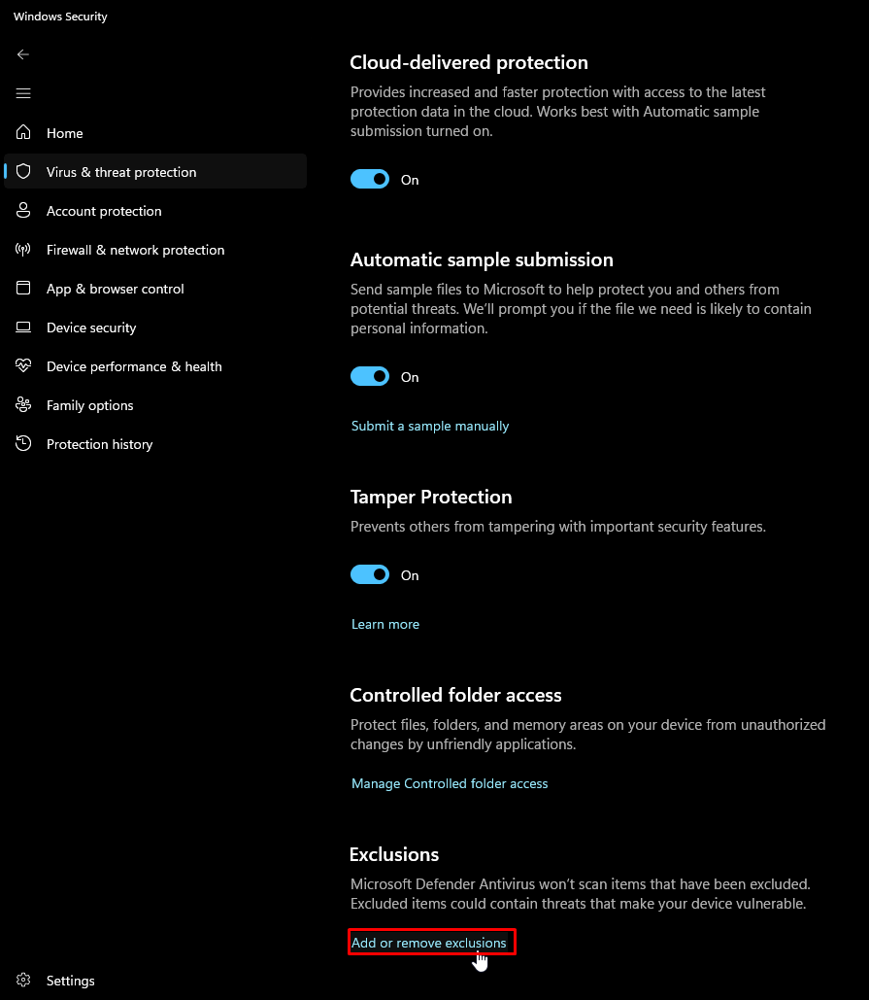
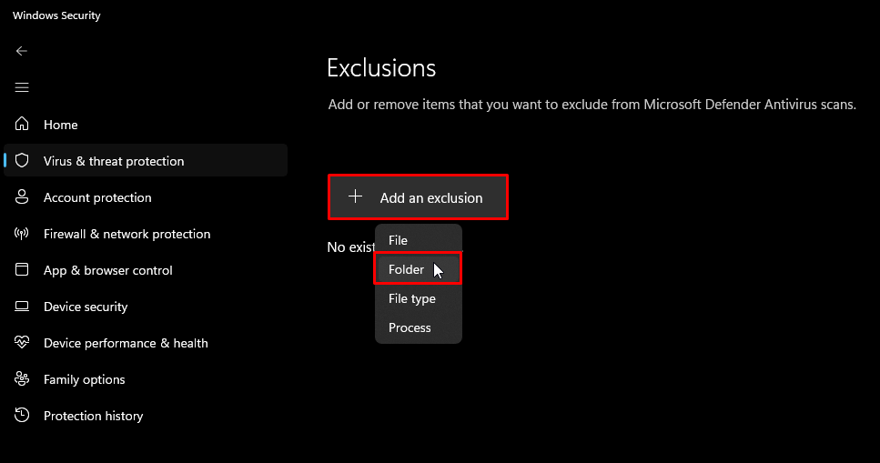
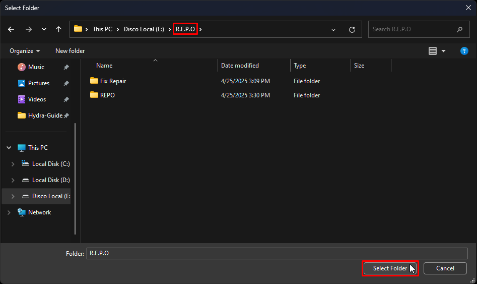

# How to add an exclusion in Windows Defender

An `exclusion` is a place where your antivirus will not scan any files.

In `Windows Defender`, you can add an exclusion for specific `Files`, `Folders`, `File Types` and `Processes`.

::: info Since in most situations your goal will be to prevent the antivirus from deleting any files from a specific game, an `exclusion` will be added for a `Folder`
::: tip To avoid problems, it is recommended to create a dedicated folder for your games, and add an `exclusion` to it. This way, no game installed within that folder will have files deleted by your antivirus, compromising its operation. 
:::

Follow these steps to add an `exclusion`:

## Open the Start menu and search for `Virus & threat protection`:

## Click on `Manage settings`:

::: warning If you use another antivirus, the `Manage settings` option will not appear in this tab, but rather the antivirus that you have installed on your computer. In this case, you will need to open it and add an `exclusion` within it.

This guide only covers `Windows Defender`, each antivirus has a different interface. 
:::

## Scroll down and click on the `Add or remove exclusions` option:

## Click on the `Add an exclusion` > `Folder` button, and select the game folder:

::: tip In `Online-fix` games, it is recommended to add an `exclusion` for the first folder of the game, which holds both `Fix Repair` and the folder with the game files itself.
:::

___

After that, the folder will be excluded.

